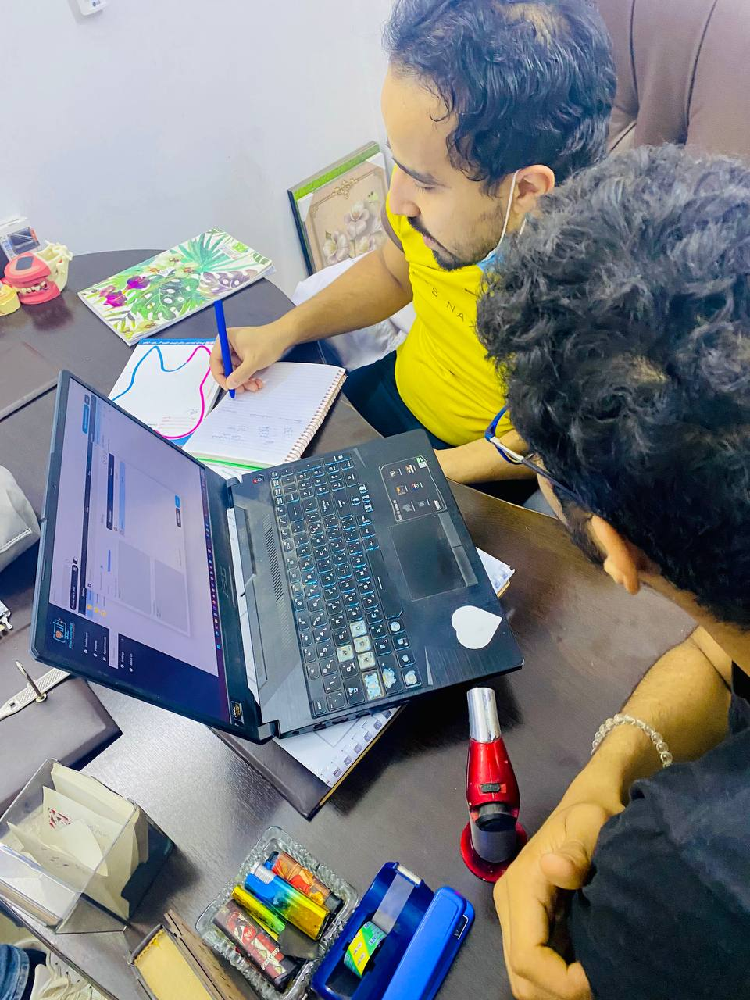
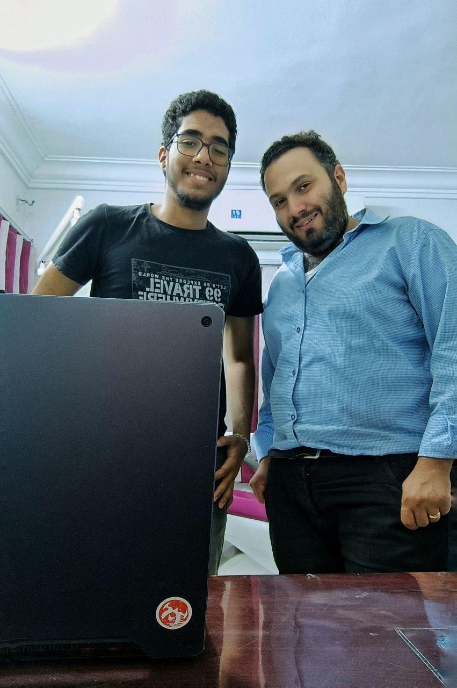

<table>
    <tr>
        <td style="width:250px; height:250px; background-color:red;text-align:center; vertical-align:middle">
            
        </td>
      <td style="width:250px; height:250px; background-color:red;text-align:center; vertical-align:middle">
            
        </td>
      <td style="width:250px; height:250px; background-color:red;text-align:center; vertical-align:middle">
            
        </td>
    </tr>
</table>

<table>
    <tr>
        <td style="width:250px; height:250px; background-color:red;text-align:center; vertical-align:middle">
            
        </td>
      <td style="width:250px; height:250px; background-color:red;text-align:center; vertical-align:middle">
            
        </td>
    </tr>
</table>

<table>
    <tr>
        <td style="width:250px; height:250px; background-color:red;text-align:center; vertical-align:middle">
            
        </td>
    </tr>
</table>
