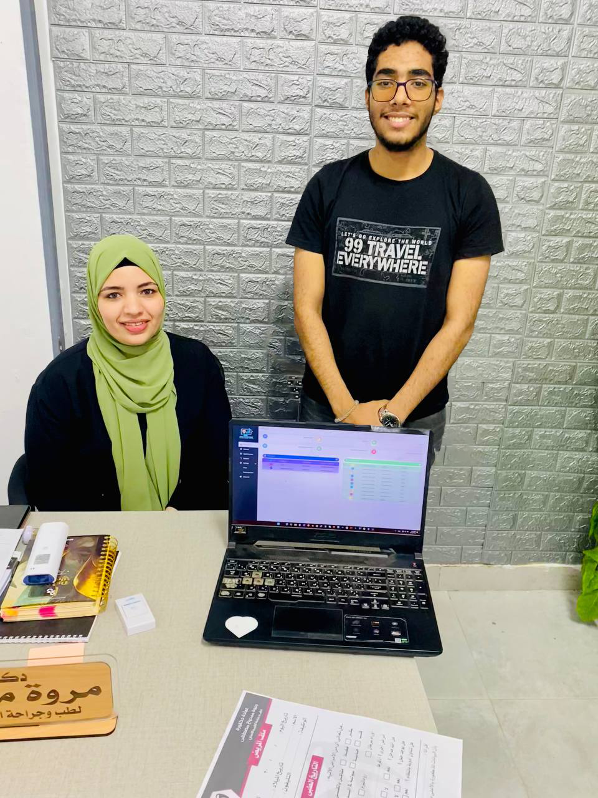

 

# Doctors' Feedback

We would like to express our sincere gratitude to the following doctors who generously dedicated their time and expertise to provide valuable feedback for ClinicXProMax. Their insights and suggestions have been instrumental in shaping our clinic management system into a robust and user-friendly solution.
    
&nbsp;
    
# DR.MAHMOUD HASSAN
 I was impressed by the user-friendly design and seamless functionality of ClinicXProMax. It simplifies the complex task of managing patient records and appointments, allowing me to focus more on delivering quality healthcare.
 

<table>
    <tr>
     <td></td>
     <td></td>
     <td></td>
    </tr>
</table>

# DR.MARWA MAMDOUH
انبهرت بالتصميم سهل الاستخدام والوظائف السلسة لـ ClinicXProMax. يبسط مهمة إدارة سجلات المرضى وجداول المواعيد.
 

<table>
    <tr>
        <td style="width:250px; height:250px; background-color:red;text-align:center; vertical-align:middle">
            
        </td>
      <td style="width:250px; height:250px; background-color:red;text-align:center; vertical-align:middle">
            
        </td>
    </tr>
</table>

# DR.AMGAD YACOUB
The team behind ClinicXProMax has done an excellent job in creating a powerful and efficient clinic management system. It has the potential to enhance the workflow of healthcare providers and improve overall patient experience.

 

 
 
 # Appreciation to Contributing Doctors
  We would like to extend our heartfelt appreciation to these doctors and all others who have contributed their insights and support to the development of ClinicXProMax. Your expertise and commitment to improving healthcare services have been invaluable.

Thank you for being an integral part of our journey towards enhancing clinic management and patient care.

If you have any questions or would like to provide further feedback, please feel free to reach out to us.
