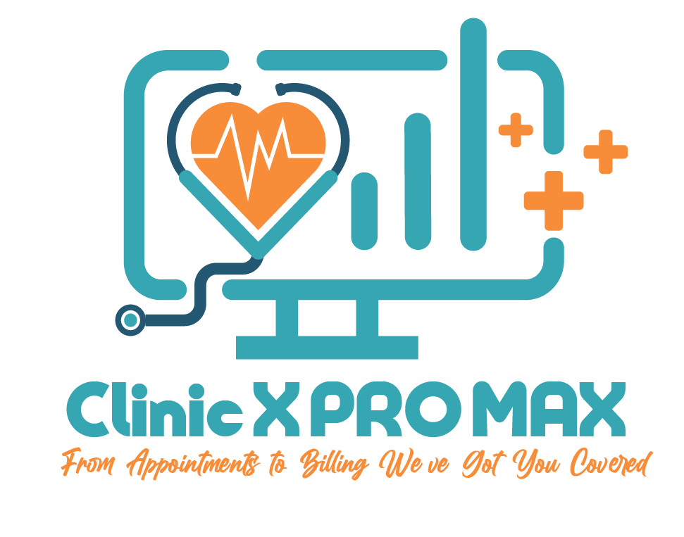

 
 <h1 align="center">ClinicXProMax</h1>
 
From Appointments to Billing, We've Got You Covered.!

## 📖 About ClinicXProMax

ClinicXProMax is a clinic management system designed to simplify administrative tasks and streamline patient care for healthcare providers. This user-friendly solution helps doctors manage patient records, schedule appointments, and manage billing in an efficient and effective way.

## 🚀 Features

- **Patient Management:** Keep track of patient information like their name, contact details, medical history, insurance details, and treatment plans.
- **Appointment Scheduling:** Schedule patient appointments, send reminders, and manage multiple schedules for doctors, nurses, and other staff.
- **Electronic Medical Records (EMR):** Create, update, and maintain digital medical records of patients, including diagnosis, medication, lab reports, and treatment notes.
- **Billing and Insurance Management:** Generate invoices, manage payments, track claims, and verify patient insurance eligibility.
- **Inventory Management:** Keep track of medical equipment, supplies, and medication inventory levels, send alerts for low stock, and automate the ordering process.
- **Reporting and Analytics:** Generate customized reports and analytics, providing insights into patient demographics, billing, inventory, and clinic operations.

## 👨‍💻 Tech stack

Here's a brief high-level overview of the tech stack ClinicXProMax uses:

- C#: ClinicXProMax is built using C#, which is a modern, object-oriented programming language that is widely used for developing Windows applications, web applications, and games. C# is known for its performance, scalability, and ease of use, making it a popular choice for building complex applications.

- .NET Framework: ClinicXProMax uses the .NET Framework, which is a software development platform that provides a comprehensive set of libraries, tools, and frameworks for building Windows desktop and web applications using C#. The .NET Framework provides a rich set of features such as memory management, security, and type safety, making it a robust and secure platform for building applications.

- GitHub: ClinicXProMax uses GitHub, which is a web-based platform for version control and collaboration that is widely used by software developers. GitHub provides a range of features such as code review, issue tracking, and project management, making it an ideal platform for managing software projects. ClinicXProMax follows the "Gitflow" branching model by Vincent Driessen, which is a popular Git branching model that provides a clear structure for managing Git branches and releases.

- GitKraken: ClinicXProMax uses GitKraken, which is a Git client that provides a visual interface for managing Git repositories. GitKraken provides a range of features such as branch visualization, merge conflict resolution, and pull request management, making it a popular choice for managing Git repositories.

## 🛠️ Installation

To download and run ClinicXProMax:

1. Click on the link to go to the GitHub repository page.
2. Locate the executable file in the "Releases" section.
3. Click on the executable file to download it onto your computer.
4. Once the download is complete, locate the downloaded file on your computer.
5. Double-click on the executable file to run it.
6. The clinic management system will run without the need for installation.

Please note that ClinicXProMax currently only works on Windows.

## 🤝 Contributing

We welcome contributions to ClinicXProMax! If you're interested in contributing, please follow these steps:

1. Fork the repository.
2. Create a new branch for your feature or bug fix.
3. Make your changes and write tests for them.
4. Run the tests and ensure they pass.
5. Commit your changes and push them to your fork.
6. Open a pull request against the main branch of the original repository.

Please ensure that your code adheres to our coding standards and follows best practices. We appreciate your contributions and look forward to working with you!

## 🌟 Spread the word!

If you want to say thank you and/or support active development of ClinicXProMax:

- Add a GitHub Star to the project!

<!-- ## ⚠️ License

The Well app is free and open-source software licensed under the GNU General Public License v3.0. All designs were created by [Cole Gawin](https://github.com/chroline) and distributed under Creative Commons license (CC BY-SA 4.0 International). -->

##

### 💛Special thanks for Minia University especially Dr.Abdullah Hassan and Eng.Shimaa Younis for there support for this project
